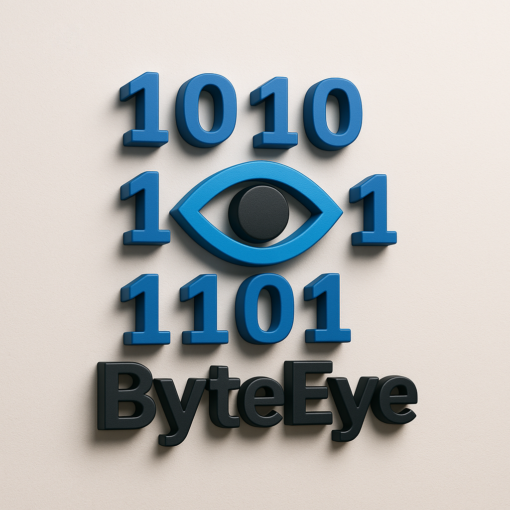

# 🔐 ByteEye - Endpoint Detection & Response (Self-Hosted)  
*Short for “Endpoint + Orchestrated Security”*

  

ByteEye is a fully self-hosted, open-source Endpoint Detection and Response system designed for local environments, homelabs, or small-scale enterprise use. It provides active threat detection, secure log collection, and real-time visibility across your endpoints without sending data to any third-party cloud providers.

---

## 🧠 Project Overview

This project demonstrates the importance of **endpoint security monitoring** and **real-time threat response**. Built with **Python and C++**, it includes:

- 🛰️ **Agent** that monitors endpoint activity  
- 🛠️ **Self-hosted Server** for secure data collection and orchestration  
- 🌐 **Web Interface** for real-time visibility and threat hunting  
- 🔐 **Encryption-first communication**, ensuring all data in transit is safe

---

## 🎯 Goals

1. **Design an encrypted agent** to safely collect system activity and send alerts.  
2. **Build a server** that handles multiple simultaneous endpoint connections.  
3. **Deploy a Web UI** for live interaction and threat event inspection.  
4. **Track development progress** using a milestone-driven plan.

---

## ⚙️ Tech Stack

| Component        | Tech Used     |
|------------------|---------------|
| Agent            | C++           |
| Server/API       | Python        |
| Communication    | TLS / AES Encryption |
| Web Interface    |               |
| Data Storage     | SQLite        |
| Logging Format   | JSON (for easy parsing) |

---

## 🚀 Features

- ✅ Process monitoring (process creation, injection attempts)  
- ✅ File system hooks (new/modified/deleted files)  
- ✅ Network traffic metadata (IP connections, ports)  
- ✅ Alerting on suspicious behaviors  
- ✅ Self-hosted (no cloud dependencies)  
- ✅ Encrypted endpoint-to-server communication  

---

## 🧪 Milestones (Dev Timeline)

- **Day 0:** Project planning and scope  
- **Ongoing:**  

---

## 📦 Installation

> ⚠️ This is a work-in-progress alpha project.

